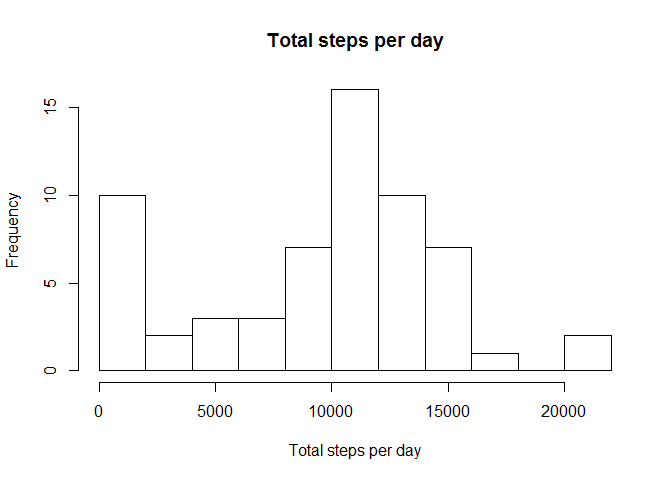
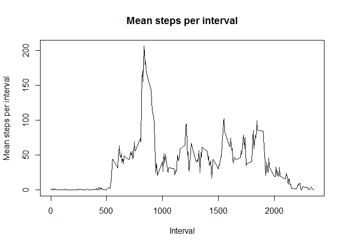
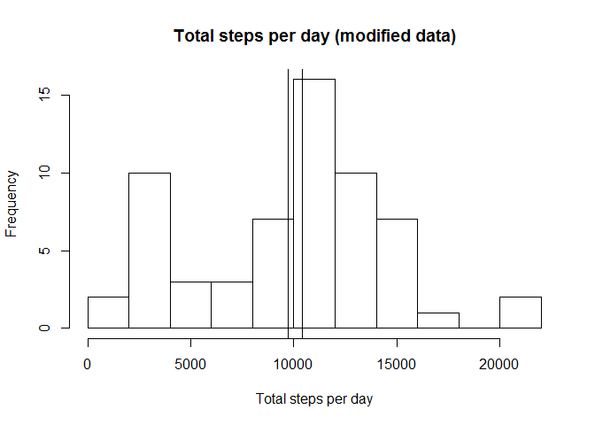
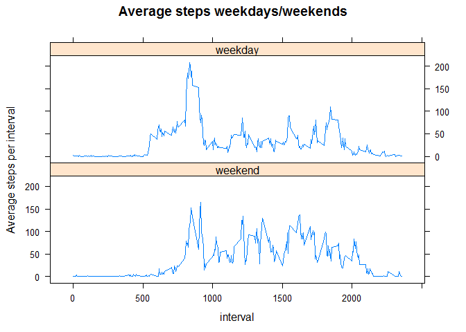

# Reproducible Research: Peer Assessment 1


## Loading and preprocessing the data

The project has been carried out in the context of the Data Science Specialization courses. This proyect has been carried out using RStudio Version  0.99.892 and R version 3.2.3 and Windows 8. Text is encoded in UTF-8. No other package than base has been loaded by now.

Sys.Date()
This is the date I retrieved the data [1] "2016-04-04"

First I check if i'm on my default Working Directory and create a new directory to download the zip file to, and downloaded the zipfile into it.

**Figures shoud have been kept in RepData\_PeerAssessment1/PA1\_template_files/figure-html**
I have used the instruction {r message=FALSE} when loading packages so I wouldn't get the obnoxious package loading messages.


```r
getwd()
```

```
## [1] "C:/Users/Alberto1/Documents/RCoursera/RepData_PeerAssessment1"
```

```r
  if (!file.exists("zipdir")){
     dir.create("zipdir")
    
fileUrl<-"https://d396qusza40orc.cloudfront.net/repdata%2Fdata%2Factivity.zip"
download.file(fileUrl,destfile="zipdir/zipfile.zip")
    }
```


If I were to extract the files using default values, their contents would be extracted into the proyect  directory, since there's a folder containing them that would be no problem, however I decided to create a new folder to store the data.


```r
  if (!file.exists("data")){
    dir.create("data")
    }

unzip("zipdir/zipfile.zip",exdir="data")
```


I clear my workspace and read the data

```r
rm(list=ls())

activity<-read.csv("./data/activity.csv")
```


I convert dates and times to actual dates and times, first I need to change my locale settings so the dates abreviations on the axis will stay in English

1st I save my current locale and then change it to english


```r
original_locale<-Sys.getlocale(category = "LC_TIME")
Sys.setlocale(category = "LC_TIME", locale = "English_United States.1252")
```

```
## [1] "English_United States.1252"
```


I create a temporary variable so I'll be able to asign the factor levels for weekdays/weekends


```r
activity$weekday<-weekdays((strptime(activity$date,"%F")))
weekdays <- c('Monday', 'Tuesday', 'Wednesday', 'Thursday', 'Friday')
activity$week<-factor((activity$weekday %in% weekdays),levels=c(FALSE, TRUE),
                                              labels=c('weekend','weekday'))
```


## What is mean total number of steps taken per day?

I now load dplyr for the usefull functions it contains

  

```r
library("dplyr")
```

To calculate the mean, and median steps by day I first need to know the total steps by day that I also print into a histogram


```r
tempbydate<-group_by(activity, date)
tspd<-summarize(tempbydate,sum(steps,na.rm=TRUE))[[2]]
meanspd<-mean(as.numeric(tspd),na.rm=TRUE)
medianspd<-median(as.numeric(tspd),na.rm=TRUE)
c(meanspd,medianspd) # The first value of this vector displays the mean
```

```
## [1]  9354.23 10395.00
```


```r
plot.new()
hist(tspd,breaks=10,abline(v=c(meanspd,medianspd)),xlab="Total steps per day",main="Total steps per day")
```




## What is the average daily activity pattern?

Now I group the data by interval so i can obtain the mean steps per interval and plot it 


```r
tempbyinterval<-group_by(activity, interval)
mspi<-summarize(tempbyinterval,mean(steps,na.rm=TRUE))[[2]]
itp<-activity$interval[activity$date=="2012-10-01"] #This is a clumsy way to get one interval
plot(itp,mspi,type="l",xlab="Interval",ylab="Mean steps per interval",main="Mean steps per interval")
```




These are the interval for which the mean steps are maximized and the number of steps

```r
c(which.max(mspi),mspi[which.max(mspi)])
```

```
## [1] 104.0000 206.1698
```


## Imputing missing values

This is to imput some value to NAs, I have chosen the median instead of the mean since the median semms more robust as it doesn't depend from extreme values that could have been recorded due to a missfunction of the device. Calculating the mode with the base seems more difficult.


```r
activitymod<-activity
dim(activitymod[activitymod$steps=="NA",])[1] #This returns the number of NA values within the data
```

```
## [1] 2304
```


I decided to calculate the median for each weekday and each interval since I suspected it could variate along both of them.


```r
tempbyintandwday<-aggregate(. ~interval + weekday, activitymod, median)[,1:3] 
```


I create this extra variable for both data frames, in order to match the median to the acivitymod data frame, however I could have simply concatenated the two of them in the "on=" argument later.


```r
tempbyintandwday$wdayinterval<-paste(tempbyintandwday$weekday,tempbyintandwday$interval,sep="")
activitymod$wdayinterval<-paste(activitymod$weekday,activitymod$interval,sep="")
```


Coercing the data frames to data tables seemed the easiest way to match the values


```r
library("data.table")
setDT(activitymod)
setDT(tempbyintandwday)
activitymod[is.na(steps), steps := tempbyintandwday[.SD, steps, on="wdayinterval"]]
```

```
## Warning in `[.data.table`(activitymod, is.na(steps), `:=`(steps,
## tempbyintandwday[.SD, : Coerced 'double' RHS to 'integer' to match the
## column's type; may have truncated precision. Either change the target
## column to 'double' first (by creating a new 'double' vector length 17568
## (nrows of entire table) and assign that; i.e. 'replace' column), or coerce
## RHS to 'integer' (e.g. 1L, NA_[real|integer]_, as.*, etc) to make your
## intent clear and for speed. Or, set the column type correctly up front when
## you create the table and stick to it, please.
```

```r
activitymod<-as.data.frame(activitymod) #And once it's done, I coerce it back to a data frame
```


In order to compare both data I decided to follow the same steps I took before for the modified data


```r
tempbydatem<-group_by(activitymod, date)
tspdm<-summarize(tempbydatem,sum(steps,na.rm=TRUE))[[2]]
meanspdm<-mean(as.numeric(tspdm),na.rm=TRUE)
medianspdm<-median(as.numeric(tspdm),na.rm=TRUE)
c(meanspdm,medianspdm)
```

```
## [1]  9704.656 10395.000
```


```r
hist(tspdm,breaks=15,xlab="Total steps per day",main="Total steps per day (modified data)")
abline(v=c(meanspdm,medianspdm))
```




It seems no great changes have happened, median stays the same, mean increases a little and for the first two breaks there's a change, it seems now that taking between 2000 and 4000 steps per day is more frequent than taking between 0 and 2000 steps, as opossed to what was shown before.

## Are there differences in activity patterns between weekdays and weekends?

I load lattice since it's a very easy way to draw panel plots and compare the average number steps per  interval during week days and weekends


```r
library("lattice")

byintandweek<-aggregate(. ~interval + week, activity[,c(1,3,5)], mean)
xyplot(steps~interval|week,data=byintandweek,layout=c(1,2),type="l",
       ylab="Average steps per interval",main="Average steps weekdays/weekends")
```




It seems that during the weekends the user walked more often but not taking as many steps on any interval as he/she did during the week days.

I finally change the locale back to the original setting

```r
Sys.setlocale(category = "LC_TIME", locale = original_locale)
```

```
## [1] "English_United States.1252"
```

